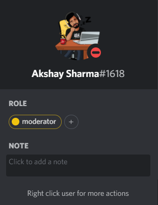

# Wall-E

A Discord Bot which do simple tasks on the server

## Tasks

- Type `!mod-me` to be assigned a moderator Role

- Delete a message & it will prompt you with the message `Stop deleting messages`

- Type `I love web` & it will react to your message with the ❤ Emoji (Remember: `I love web` is Case-Sensitive)

#### Want to try it out yourself then Join the [Discord Server](https://discord.gg/rqEr8jTz) to try it out